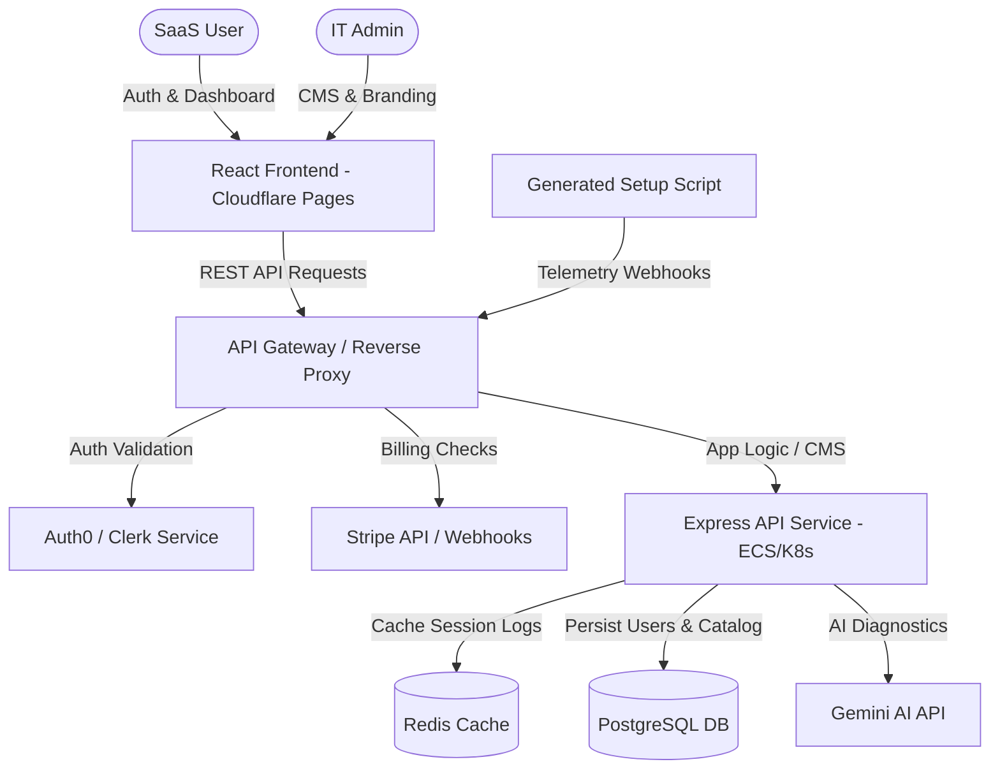

# EasySetup SaaS Platform Audit Report

This audit report evaluates the codebase of **EasySetup**, an automated, session-aware developer environment setup tool with AI error diagnostics. It identifies fully implemented features, partially mocked/simulated components, untouched files, and provides a clear blueprint for upgrading the application into a production-grade SaaS platform.

---

## 1. Executive Summary
EasySetup is designed as a hybrid client-server application. 
- **The Client (React + Vite + Tailwind CSS)** provides a rich, premium user experience including onboarding wizards, software selectors, script downloads, live diagnostics chat, scaffolding previews, and an admin CMS.
- **The Server (Express + tsx)** hosts the front-end SPA and processes AI setup diagnoses using Google Gemini AI, featuring a deterministic, cost-optimized error safelist.

While the core installation script generation and AI diagnosis loop are functional, the SaaS billing, user authentication, data persistence, and custom CMS changes are currently simulated in React client-side state.

---

## 2. Codebase Audit

### 2.1. What is DONE (Fully Functional & Operational)
These modules are fully implemented with operational logic, complete user interfaces, and integration between client and server:

1. **OS Detection & Interactive Onboarding Wizard (`src/components/OnboardingWizard.tsx`, `src/App.tsx`)**:
   - Correctly reads `navigator.userAgent` to determine if the host is running Windows or macOS.
   - Multi-step wizard recommends software bundles dynamically based on persona selection (General/Developer) and stack specialization (Web, AI/ML, App Dev, etc.).
2. **Dynamic Script Generation Engine (`src/utils/scriptGenerator.ts`)**:
   - **Windows (`.bat`)**: Generates a script that requests Admin privileges, modifies PowerShell process policies, validates/installs `winget`, logs progress to `setup-log.txt`, and pops up native message boxes.
   - **macOS (`.command`)**: Generates a script that auto-provisions Homebrew/Casks, logs to Desktop, and triggers AppleScript system notifications.
   - Injects the unique session ID and customized branding settings (tagline, support URLs, colors) directly into the generated file headers in real-time.
3. **Deterministic Error Safelist (`src/data/safelistData.ts`, `server.ts`)**:
   - Intercepts error logs before calling Gemini AI. Operates on the server side to instantly diagnose known failures (PowerShell policy, missing winget, missing brew, access denied) to reduce API consumption and improve response times.
4. **AI Error Diagnostics API (`server.ts`, `src/components/AiSetupChat.tsx`, `src/components/AiFixLoop.tsx`)**:
   - Integrates with the `@google/genai` SDK using `gemini-3.6-flash`.
   - Constrains outputs using a JSON schema (`responseSchema`), returning plain English explanations, confidence levels, and safe fix commands.
   - Standardized log parser (`src/utils/logParser.ts`) detects successful vs. failed apps and extracts relevant error text.
5. **Interactive Fix Loop Script Regeneration**:
   - Prepend accepted fixes to the script manifest.
   - Downloads a regenerated setup script (`_v2` suffix) containing the fix command and retries only the failed apps.

---

### 2.2. What is NEEDED TO BE DONE (Simulated / Mocked)
These features are present in the UI but rely on local, temporary React state or simulated functions. They must be connected to real back-end services and persistent databases:

1. **SaaS User Authentication (`src/components/AuthModal.tsx`)**:
   - *Current State*: The sign-up/sign-in flows (including Google SSO) use `setTimeout` triggers and return static mock user data (`UserProfile`).
   - *Requirement*: Integrate a real authentication provider (e.g., Clerk, Supabase Auth, Firebase Auth, or OAuth2 with Passport.js).
2. **Data & Session Persistence (`src/App.tsx`, `src/components/UserAccountModal.tsx`)**:
   - *Current State*: User sessions, generated scripts history, and diagnostic records are stored in React state. Refreshing the browser completely wipes out user history, sessions, and quotas.
   - *Requirement*: Persist users, generated sessions, and diagnostic records in a relational database (e.g., PostgreSQL or MongoDB) via a backend REST/GraphQL API.
3. **SaaS Billing & Plan Quotas (`src/components/PricingModal.tsx`)**:
   - *Current State*: Upgrades and monthly AI diagnostics call quotas are simulated. Clicking upgrade simply modifies React state values.
   - *Requirement*: Connect the subscription modals to a billing provider (e.g., Stripe, Lemon Squeezy, or Paddle) via webhooks to handle subscription states (Free, Pro, Team).
4. **Admin Panel CMS Persistence (`src/components/AdminPanel.tsx`)**:
   - *Current State*: Changes to the software catalog, scaffolding templates, or branding settings are made in React state. Refreshing the page resets all configurations to defaults.
   - *Requirement*: Implement database update API routes (`POST /api/catalog`, `PUT /api/branding`) to save admin settings permanently.
5. **Scaffolding CLI Starters (`src/components/TemplateScaffolding.tsx`)**:
   - *Current State*: Displays commands like `npx create-easysetup-app` and `pip install easysetup-cli` as visual guidelines.
   - *Requirement*: Build and publish actual npm (`create-easysetup-app`) and PyPI (`easysetup-cli`) packages containing code scaffolders, or compile them as binary executables.

---

### 2.3. What was NOT TOUCHED
These are basic configuration or structural project files left in their default states:
- `index.html` (Standard SPA mount point)
- `tsconfig.json` (TypeScript compilation rules)
- `vite.config.ts` (Standard Vite config utilizing `@tailwindcss/vite` and `@vitejs/plugin-react`)
- `.gitignore` (Standard Git configuration rules)
- `index.css` (Contains only imports; styles are driven by Tailwind CSS utilities in code)

---

## 3. What CAN Be Added (Product Optimization Features)
*Features that enhance individual developer and student onboarding experiences:*

1. **Visual Log Uploader**:
   - Drag-and-drop zone in the AI Fix Chat to upload the `setup-log.txt` file directly, instead of requiring manual copy-pasting.
2. **Setup Script execution progress Webhook**:
   - Modify the `.bat` and `.command` scripts to send telemetry pings (`curl` or `Invoke-RestMethod`) back to the server upon each successful or failed app installation. This would allow the web dashboard to show installation progress in real-time.
3. **Host Compatibility Checks**:
   - Add script checks for available disk space, system memory, architecture type (x64 vs ARM64), and OS version mismatch before beginning installation.
4. **Interactive Command Runner Console**:
   - A copy-to-clipboard action that formats script execution into a single line for terminal execution (e.g., `curl -sS https://easysetup.dev/s/session-id | bash`).
5. **Script Generator Customization Options**:
   - Option to include/exclude specific package manager parameters (e.g., force install, install for all users, bypass warnings).

---

## 4. What SHOULD Be Added (Enterprise SaaS Architecture)
*Requirements to convert this prototype into a secure, scalable, multi-tenant enterprise software-as-a-service (SaaS) platform:*

### 4.1. Secure Authentication & Multi-Tenancy
- **OIDC/SAML Integration**: Implement single sign-on (SSO) using Okta, Azure AD, or Auth0 for enterprise customers.
- **Tenant Isolation**: Model database schemas such that users are mapped to organization IDs, ensuring strict data access partitions.

### 4.2. Database Architecture & API Security
- **Relational Storage (PostgreSQL)**: Define models for `Users`, `Profiles`, `Sessions`, `SoftwareCatalog`, `BrandingSettings`, and `DiagnosticLogs`.
- **API Rate Limiting**: Implement middleware (e.g., `express-rate-limit` or Redis rate-limiters) to protect the `/api/diagnose-error` endpoint from AI quota abuse.
- **API Keys / Token Management**: Provide API tokens for developers to fetch setup manifests programmatically in CI/CD pipelines.

### 4.3. Billing Integration & Subscription Life Cycle
- **Stripe Subscriptions**: Set up Stripe Billing with webhooks to listen for `invoice.payment_succeeded`, `customer.subscription.deleted`, and `customer.subscription.updated` events to dynamically adjust user quotas.
- **Metered Billing Engine**: Record AI diagnosis queries and script generations to charge based on usage once monthly limits are reached.

### 4.4. CLI and Installer Security
- **Code Signing**: Sign generated `.bat` (via Authenticode certificates) and `.command` scripts (notarized via Apple Developer Certificate). This stops Windows SmartScreen and macOS Gatekeeper from blocking the scripts, eliminating security warnings.
- **Secure CDN Script Delivery**: Route generated scripts through a fast CDN (e.g., Cloudflare) utilizing short-lived presigned URLs.

### 4.5. Telemetry & Analytics Dashboard
- **Error Telemetry**: An endpoint (`POST /api/telemetry/log`) to capture error traces from the shell script runs.
- **IT Admin Panel**: Allow corporate IT admins to view onboarding completion rates, average setup times, and common failure modes across their fleet of developer machines.
